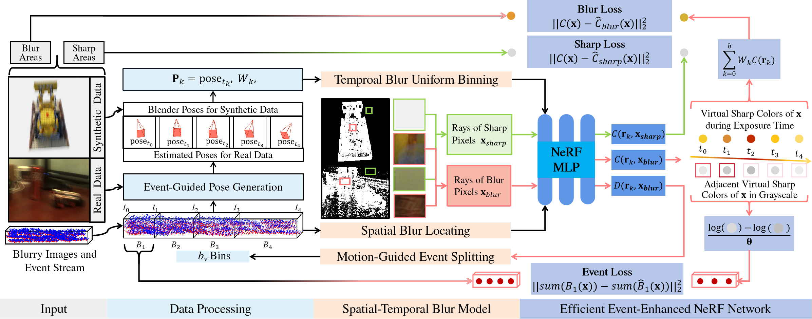

# Code for E<sup>3</sup>NeRF: Efficient Event-Enhanced Neural Radiance Fields from Blurry Images
This is an official PyTorch implementation of the E<sup>3</sup>NeRF. Click [here](https://icvteam.github.io/E3NeRF.html) to see the video and supplementary materials in our project website.

## Method Overview
Our E<sup>3</sup>NeRF further leverage the spatial-temporal blur prior in event stream to realize more efficient ERGB-based deblurring NeRF reconstruction.


The framework of E<sup>3</sup>NeRF is based on E<sup>2</sup>NeRF, with the addition of "Event-Guided Temporal Blur Uniform Binning", "Event-Guided Spatial Blur Locating", and "Motion-Guided Event Splitting".


## Installation
The code is based on [nerf-pytorch](https://github.com/yenchenlin/nerf-pytorch) and use the same environment.
Please refer to its github [website](https://github.com/yenchenlin/nerf-pytorch) for the environment installation.

## Code

### Synthetic Dataset

Please download the processed [Synthetic Dataset](https://drive.google.com/drive/folders/1xoaMSgiKt4rB3sW5iKh6jUPmyWF9MdH2?usp=sharing) and put it into the corresponding file (./dataset/). Then you can use the command below to train and test the model with the slight shake data and severe shake data, respectively.

```
python run_nerf_synthetic_slight.py --config config_synthetic_slight.txt
python run_nerf_synthetic_severe.py --config config_synthetic_severe.txt
```

### Real-World-Blur Dataset
Please download the processed [Real-World-Blur](https://drive.google.com/drive/folders/1ca_IJxOoWH2wSgM1nSWeJIbh6MwdSGFO?usp=sharing) dataset and put it into the corresponding file (./dataset/). Then you can use the command below to train and test the model.

```
python run_nerf_real_world_blur.py --config config_real_world_blur.txt
```

### Real-World-Challenge Dataset
Please download the processed [Real-World-Challenge](https://drive.google.com/drive/folders/1iy0266P29K3O2PexX1obhtEPo4fqBKDY?usp=sharing) dataset and put it into the corresponding file (./dataset/). Then you can use the command below to train and test the model.

```
python run_nerf_real_world_challenge.py --config config_real_world_challenge.txt
```


## Dataset

### Synthetic Dataset
We provide the original blender data, original data, and processed data of synthetic slight/severe shake data for E<sup>3</sup>NEeRF training. Please down load them [here](https://drive.google.com/drive/folders/1xoaMSgiKt4rB3sW5iKh6jUPmyWF9MdH2?usp=sharing).

**Blender Data:**

We provide the original blender files to generate the original data for training and testing. Please first install the [Camera Shakify Plugin](https://github.com/EatTheFuture/camera_shakify?tab=readme-ov-file) and then run the script with blender.

**Original Data:**

The original data of each scene contains original images of each view in the "r_xx" folder and the corresponding camera pose data in the "transforms.json" file.

**Processed Data:**

The Processed Data includes "events.pt", "frames_weights.npy", "event_mask.npy", and "poses_index_all.npy", which facilitates the event loss calculation, provides temporal and spatial blur prior, provides poses index for training and testing, respectively. It also contains the synthetic blurry images for training in the "train" folder.

**Generate Processed Data with Original Data:**

First, download the original data and put it in the "dataset" folder.
Second, run "dataset/data_preprocess_synthetic_slight.py" and "dataset/data_preprocess_synthetic_severe.py" to generate the "events.pt", "frames_weights.npy", "event_mask.npy", "poses_index_all.npy", and the synthetic blurry images for slight shake and severe shake data, respectively.


### Real-World-Blur Dataset
We provide both original data and processed data for E<sup>3</sup>NEeRF training. Please down load them [here](https://drive.google.com/drive/folders/1ca_IJxOoWH2wSgM1nSWeJIbh6MwdSGFO?usp=sharing).

**Original Data:** 

The original data consist of two folders in each scene's folder. "images"-The blurry images for training; "events"-The events corresponding to the blurry images.

**Processed Data:**

Compared to Original Data, Processed Data includes "events.pt", "frames_weights.npy", "event_mask.npy", and "pose_bounds.npy", which facilitates the event loss calculation, provides temporal and spatial blur prior, provides poses for training and testing, respectively.

**Generate Processed Data with Original Data:**

First, download the original data and put it in the "dataset" folder.
Second, run "dataset/data_preprocess_real_world_blur.py" to generate the "events.pt", "frames_weights.npy", "event_mask.npy", and images for pose estimation.
Third, use colmap to estimate the poses of images in the "images_pose" folder.
Finally, run "dataset/data_preprocess_imgs2poses.py" to generate the "pose_bounds.npy" for training.

### Real-World-Challenge Dataset
We provide both original data and processed data for E<sup>3</sup>NEeRF training. Please down load them [here](https://drive.google.com/drive/folders/1iy0266P29K3O2PexX1obhtEPo4fqBKDY?usp=sharing).

**Original Data:** 

The original data consist of three folders in each scene's folder. "images"-The blurry images for training; "events"-The events corresponding to the blurry images; "gt"-The ground truth sharp images for testing.

**Processed Data:**

Compared to Original Data, Processed Data includes "events.pt", "frames_weights.npy", "event_mask.npy", and "pose_bounds.npy", which facilitates the event loss calculation, provides temporal and spatial blur prior, provides poses for training and testing, respectively.

**Generate Processed Data with Original Data:**

First, download the original data and put it in the dataset folder.
Second, run "dataset/data_preprocess_real_world_challenge.py" to generate the "events.pt", "frames_weights.npy", "event_mask.npy", and images for pose estimation.
Third, use colmap to estimate the poses of images in the "images_pose" folder.
Finally, run "dataset/data_preprocess_imgs2poses.py" to generate the “pose_bounds.npy” for training.

## Citation

If you find this useful, please consider citing our paper:

```bibtex
@inproceedings{qi2023e2nerf,
  title={E2NeRF: Event enhanced neural radiance fields from blurry images},
  author={Qi, Yunshan and Zhu, Lin and Zhang, Yu and Li, Jia},
  booktitle={Proceedings of the IEEE/CVF International Conference on Computer Vision},
  pages={13254--13264},
  year={2023}
}
@article{qi2024e3nerf,
  title={E3NeRF: Efficient Event-Enhanced Neural Radiance Fields from Blurry Images},
  author={Qi, Yunshan and Li, Jia and Zhao, Yifan and Zhang, Yu and Zhu, Lin},
  journal={arXiv preprint arXiv:2408.01840},
  year={2024}
}
```

## Acknowledgment

The overall framework are derived from [nerf-pytorch](https://github.com/yenchenlin/nerf-pytorch/) and [E<sup>2</sup>NeRF](). We appreciate the effort of the contributors to these repositories.
